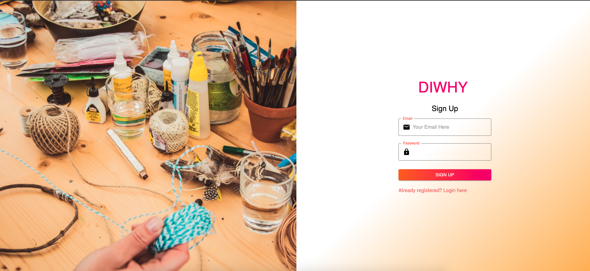
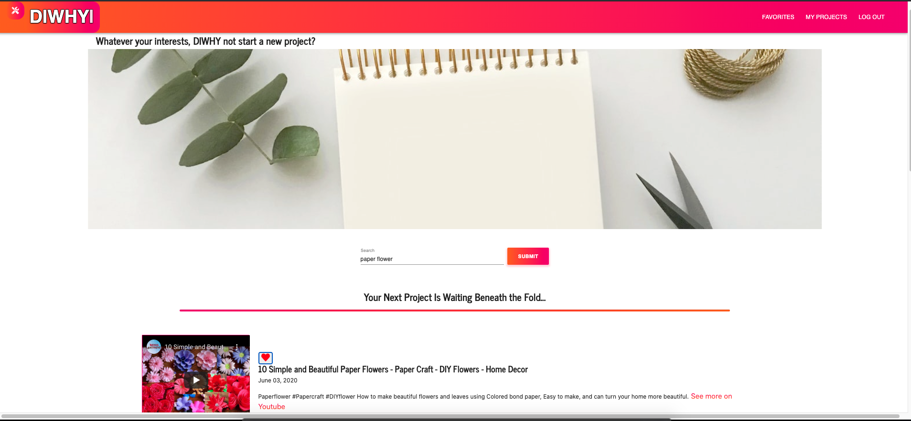
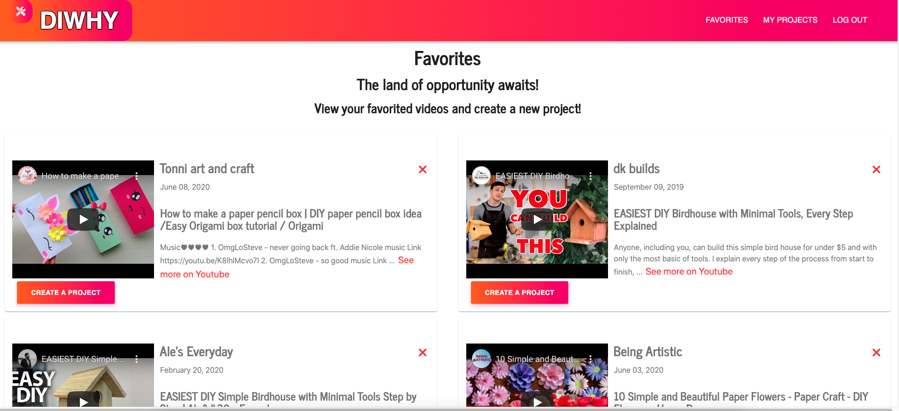
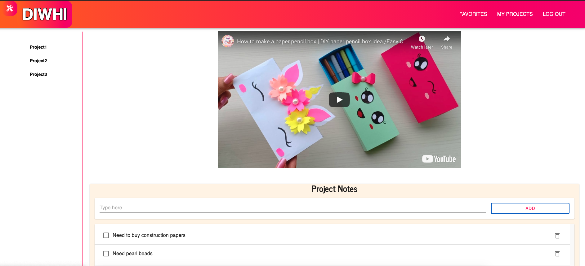

# DIWHY
 


## Description & Deployment
This app has multiple functionality and meant for users who like to explore DIY projects. Users can find DIY projects based on their interest and can add liked projects to their favorite list. On favorite page user can view the liked projects and delete them as well. Favorite page also presents an option to start a project that redirects the user to project page. User can watch the video on project page and make a todo list on the same page.

[Visit the deployed app here](https://diwhyyy.herokuapp.com/)

---

## Table of Contents
1. [Installation](#Installation)
2. [Usage](#Usage)
3. [License](#license)
4. [Contributing](#Contributing)
5. [Future Enhancements](#Future-enhancements)
6. [Questions & Links](#Questions-&-links)
---

## Installation
The user must clone down the repo and run 
```
npm install
```
to install axios, express, react, mongoose, dotenv and firebase packages. Afterwards, the user can then run the command 
``` 
npm start 
```
and they will be ready to use the app.

## Usage
First sign up with your email and password. 



The app will log you in and you can begin by entering your interest. Click the submit button and the app will provide you DIY project videos based on your interest.







---

## License
### ISC License
Copyright (c) 2020 Brianna Bullock, Ben de Garcia, Michael Zaslavsky and Arpita Sau

Permission to use, copy, modify, and/or distribute this software for any purpose with or without fee is hereby granted, provided that the above copyright notice and this permission notice appear in all copies.

THE SOFTWARE IS PROVIDED "AS IS" AND THE AUTHOR DISCLAIMS ALL WARRANTIES WITH REGARD TO THIS SOFTWARE INCLUDING ALL IMPLIED WARRANTIES OF MERCHANTABILITY AND FITNESS. IN NO EVENT SHALL THE AUTHOR BE LIABLE FOR ANY SPECIAL, DIRECT, INDIRECT, OR CONSEQUENTIAL DAMAGES OR ANY DAMAGES WHATSOEVER RESULTING FROM LOSS OF USE, DATA OR PROFITS, WHETHER IN AN ACTION OF CONTRACT, NEGLIGENCE OR OTHER TORTIOUS ACTION, ARISING OUT OF OR IN CONNECTION WITH THE USE OR PERFORMANCE OF THIS SOFTWARE. 

---
## Contributing
If a developer wishes to contribute to this project, please send an email using the link below.

---

## Future Enhancements
In the future, we plan to expand the app, giving the users more option/guide on projects.
## Questions & Links

To see more of our work, you can visit [Brianna's Github Profile](https://www.github.com/kairora), [Ben's Github Profile](https://github.com/bdegarcia), [Michael's Github Profile](https://github.com/MichaelZ002)or [Arpita's Github Profile](https://github.com/arpitasau).  You may also peek at [this app's Github repo](https://github.com/MichaelZ002/project-three) to learn more about this program.